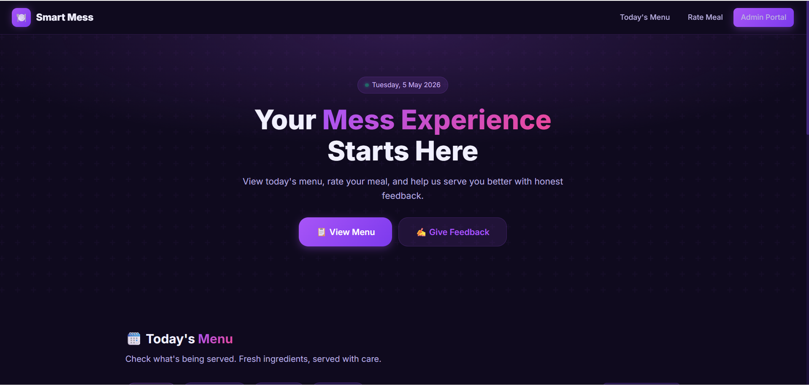
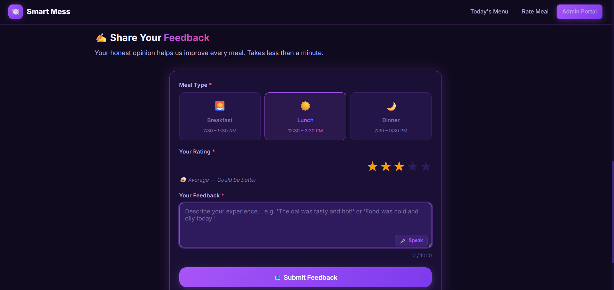

# 🍽️ Smart Mess — AI Food Quality Analyzer

In many hostels, students face issues like poor food quality, unhygienic conditions, and repetitive menus, but there is no efficient system to track and analyze these problems. Feedback is often ignored or unstructured, making it difficult for administrators to take action.

Smart Mess addresses this problem by providing a digital platform where students can submit feedback easily. The system uses NLP-based sentiment analysis to automatically evaluate feedback, detect common complaints, and generate insights. This helps mess administrators understand real issues and improve food quality, hygiene, and overall student satisfaction.


---

## 🚀 Overview

Smart Mess  is designed to solve real-world problems in hostel food systems by combining:

* 📊 Real-time feedback collection
* 🤖 AI-based sentiment analysis
* 🔐 Secure admin dashboard (JWT authentication)
* 📈 Analytics & insights for better decision-making

---

## ✨ Key Features

### 👨‍🎓 Student Side

* Submit daily food feedback
* View mess menu
* Simple and responsive UI

### 👨‍💼 Admin Side

* Secure login with JWT authentication
* View all feedback in real-time
* Manage daily menu
* Access analytics dashboard

### 🧠 AI / NLP Features

* Sentiment analysis (Positive / Neutral / Negative)
* Keyword extraction (30+ food-related issues)
* Complaint detection (e.g., oily, cold, stale)
* Rating-adjusted sentiment scoring
* Automated insights & recommendations

---

## 🛠️ Tech Stack

**Frontend**

* HTML, CSS, JavaScript

**Backend**

* Node.js
* Express.js

**Database**

* MongoDB

**Other**

* JWT Authentication
* Custom NLP engine (no external ML libraries)

---

## 📁 Project Structure

```
smart-mess/
├── backend/
│   ├── server.js
│   ├── seed.js
│   ├── models/
│   ├── routes/
│   ├── controllers/
│   ├── middleware/
│   └── utils/nlp.js
└── frontend/
    ├── index.html
    ├── login.html
    ├── admin.html
    ├── css/
    └── js/
```

---

## 🚀 Getting Started

### 1️⃣ Start MongoDB

```bash
mongod --dbpath /data/db
```

### 2️⃣ Install dependencies

```bash
cd backend
npm install
```

### 3️⃣ Setup environment variables

Create a `.env` file inside `backend/`:

```
MONGO_URI=your_mongodb_connection_string
JWT_SECRET=your_secret_key
PORT=5000
```

### 4️⃣ Seed database (run once)

```bash
node seed.js
```

### 5️⃣ Start server

```bash
npm start
```

### 6️⃣ Open in browser

```
http://localhost:5000
```

---

## 🔐 Admin Credentials (Demo)

```
Username: admin
Password: admin123
```

---

## 🔌 API Endpoints

| Method | Endpoint             | Description              |
| ------ | -------------------- | ------------------------ |
| POST   | `/api/feedback`      | Submit feedback          |
| GET    | `/api/feedback`      | Get all feedback (Admin) |
| POST   | `/api/admin/login`   | Admin login              |
| GET    | `/api/admin/profile` | Get admin profile        |
| GET    | `/api/menu`          | Get daily menu           |
| POST   | `/api/menu`          | Add/update menu          |
| DELETE | `/api/menu/:id`      | Delete menu              |
| GET    | `/api/analytics`     | Get analytics            |

---

## 📸 Screenshots

### 🏠 Student Portal


### 📝 Feedback Page


### 📊 Admin Dashboard

---

## 🌟 Future Improvements

* Deploy to cloud (Vercel / Render)
* Add real ML model (instead of rule-based NLP)
* Mobile app integration
* Multi-user authentication

---

## 👨‍💻 Author

**Sakshi Joshi**

---

## 📌 Conclusion

Smart Mess demonstrates how AI can be applied to solve everyday problems like food quality monitoring using simple yet effective techniques.

---

⭐ If you like this project, consider giving it a star!
